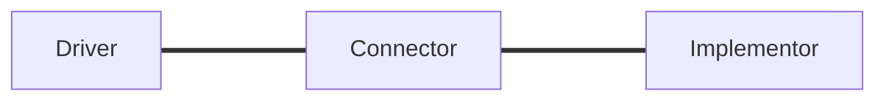
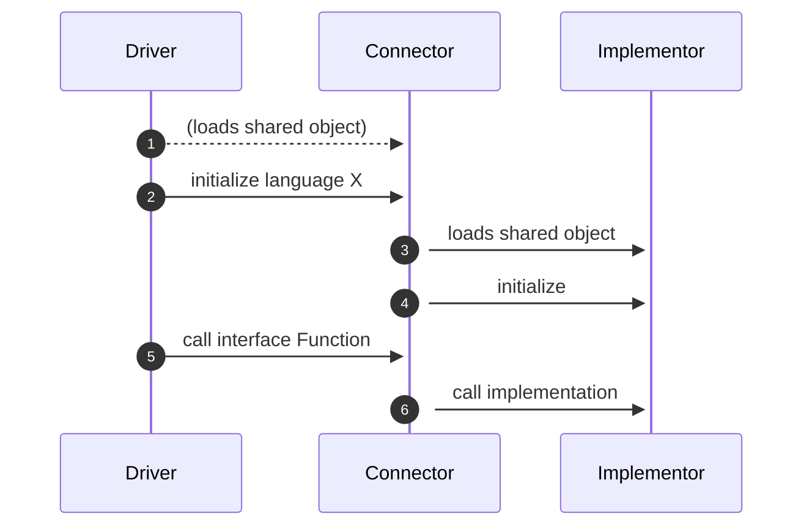
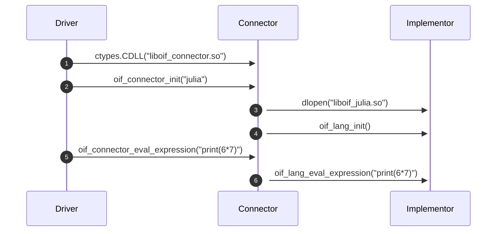

# `Towards Foundations for Open Interfaces for Scientific Computing`

<small>René Fritze</small>

<small>rene.fritze@wwu.de</small>

<small>Mathematics Münster</small>

<small>October 28, 2022</small>

<small>*1st MaRDI Workshop on Scientific Computing*</small>

---

# `openInterfaces`

<small>René Fritze</small>

<small>rene.fritze@wwu.de</small>

<small>Mathematics Münster</small>

<small>October 28, 2022</small>

<small>*1st MaRDI Workshop on Scientific Computing*</small>

---

<div class="container">

<div>

## Get the slides

[https://renefritze.github.io/22-10-mardi-workshop](https://renefritze.github.io/22-10-mardi-workshop)

</div>

<div>

</div>
</div>

---

# Outline

1. A story
1. Goals
2. Prototype
3. The future

---

# A story

---


## Meet Alice

- Alice has a new project: implement model order reduction for a
  complex PDE with specifically structured input data

<div class="footnote">

[Portrait illustration vector created by freepik - www.freepik.com](https://www.freepik.com/vectors/portrait-illustration)

</div>
---

## Meet Alice

- She inherited a C++ solver for the PDE
- She found a Julia package that can generate vector fields that
  exactly fit her model
- She discovered that pyMOR already implements all the MOR methods she'll need

---

## Option 1

- Reimplement the data field generation in her C++ code
- Reimplement all the MOR methods in her C++ code

---

## Option 2

- Learn the internals of calling Julia and Python Code
from C++
- Write custom bindings for her C++ solver

---

## Downsides

- Lots of code to rewrite.
- Translation needs expertise in 3 languages to get right.
- Writing bindings very different from usual workload
- Portability + Maintainability

---

## Option 3?

What if she could structure her code in a way
that enabled her to plug in a tool that does the bindings for her?

---

# `openInterfaces` Goals

- develop and establish open interface standards
- interconnect disparate numerical softwares
- provide abstractions for the benchmark framework

---

## interface standards

- data abstractions specifications
- API requirements for algorithms

---

## disparate software

Two packages adhering to `openInterface` standards
should be able to call into one another, no matter
their implementation language.

---

<div class="container">

<div>

## Prototype

[https://github.com/MaRDI4NFDI/open-interfaces/](https://github.com/MaRDI4NFDI/open-interfaces/)

</div>

<div>

</div>
</div>

---

## Prototype Project Setup



---

## Prototype Project Setup

- Connector is a C library
- Driver isolated from Implementor
- Drivers can dynamically load or statically link against Connector
- Connector dynamically loads Implementor

---

## Runtime flow



---

# Algorithm test cases

1. String expression evaluation
2. Linear system solve

   $Ax=b$

---

# API Design

```C
// Connector's interface (What the Drivers, aka Alice, see)
int oif_connector_init(const char *lang);
int oif_connector_eval_expression(const char *str);
int oif_connector_solve(int N, double* A,
                        double* b, double *x);
void oif_connector_deinit();
```

---

# API Design

```C
// Implementor's interface (What the Connector sees)
int oif_lang_init();
int oif_lang_eval_expression(const char *str);
int oif_lang_solve(int N, double* A,
                   double* b, double *x);
void oif_lang_deinit();
```

---

# Python -> Julia Example



---

# Available Drivers and Implementors

- C
- C++
- Python
- Julia
- (R)

---

# Misc

- Testing all Driver -> Implementor Combinations (with pytest)
- Documentation Setup (Sphinx + Doxygen via breathe)
